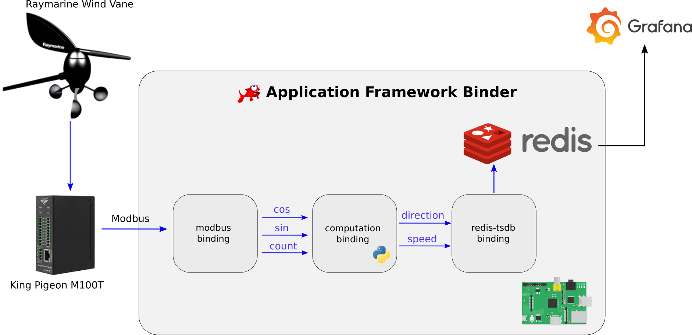

# Anemometer industrial demo

This repository contains an example of Redpesk's Application Framework's binding written in Python.
It reads data coming from a Modbus device and publishes modified values to a Redis timeseries.

The repository contains both the binding written in Python as well as the spec file and configuration files meant to be deployed on a target embedded board.

Please refer to the [online documentation](https://docs.redpesk.bzh/docs/en/master/redpesk-industrial/docs/introduction.html) for a step-by-step introduction.

